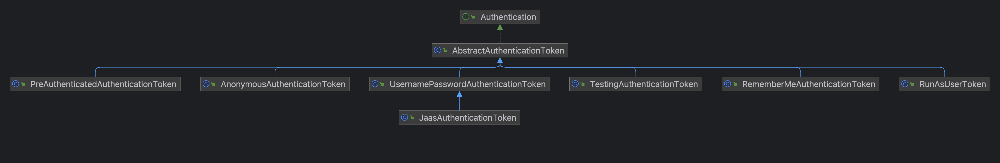
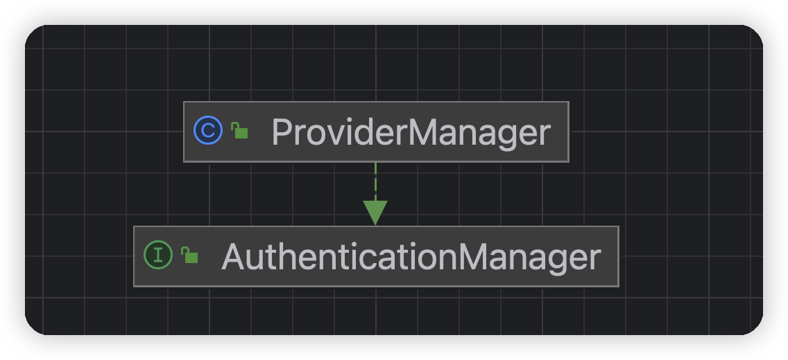
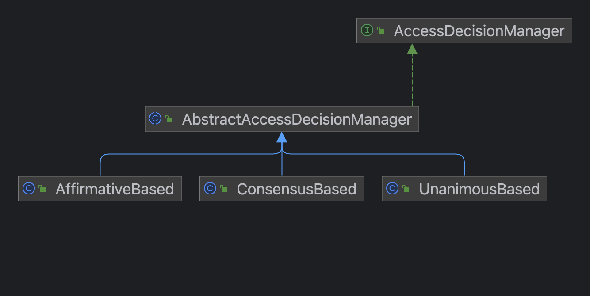
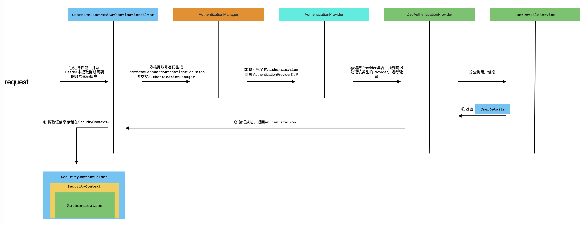
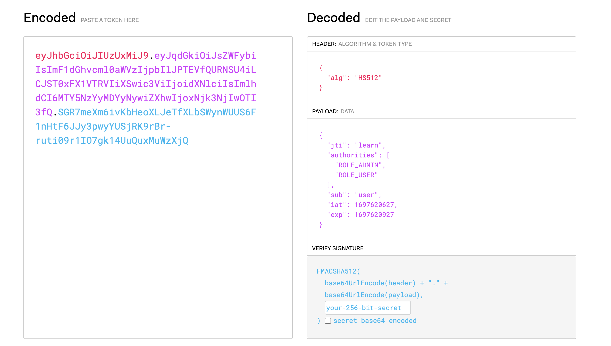

# Spring Security
> 个人学习Security时记录，仅供参考
>
> JDK版本：1.8
>
> SpringBoot版本：2.7.10
>
> Security版本：5.7.7

## Security相关

### 认证和授权

​	认证(Authentication)：主要是通过一些信息进行身份的验证，解决“我是谁”的问题

​	授权(Authorization)：主要是进行访问权限的授予，解决“我能干什么”的问题

### CSRF攻击

​	CSRF攻击是一种利用用户在目标网站上已认证的会话执行非预期操作的攻击方式。攻击者通过欺骗用户使其在受信任的网站上执行恶意操作，如转账、修改账户信息等。攻击者利用用户的信任关系和浏览器的自动发送请求的特性，向目标网站发送伪造的请求。

​	前后端分离的项目对CSRF攻击天然免疫，因为其通常是使用Token来验证用户。

### Spring Filters

**Filter**

**Filter Chain**

**常见的Filter**

1. BasicAuthenticationFilter

   如果在请求中找到一个 Basic Auth HTTP 头，则尝试用该头中的用户名和密码验证用户。

2. UsernamePasswordAuthenticationFilter

   如果在请求参数或者 POST 的 Request Body 中找到用户名/密码，则尝试用这些值对用户进行身份验证.

3. DefaultLoginPageGeneratingFilter

   默认登录页面生成过滤器。用于生成一个登录页面，如果你没有明确地禁用这个功能，那么就会生成一个登录页面。这就是为什么在启用 Spring Security 时，会得到一个默认登录页面的原因。

4. DefaultLogoutPageGeneratingFilter

   如果没有禁用该功能，则会生成一个注销页面。

5. FilterSecurityInterceptor

   过滤安全拦截器。用于授权逻辑。

### Security Config

Spring Security在5.7.0-M2及之后，弃用` WebSecurityConfigurerAdapter `进行配置

详细说明：https://spring.io/blog/2022/02/21/spring-security-without-the-websecurityconfigureradapter

``` java
/**
 * Rest安全配置
 *
 * @author Sunjianwang
 * @version 1.0
 */
@Slf4j
@Configuration
public class SecurityConfig{

    @Resource
    private AuthenticationConfiguration authenticationConfiguration;

    /**
     * 在Spring Security5.7.0-M2之后，使用此方法进行Http安全配置
     * @param http
     * @return
     * @throws Exception
     */
    @Bean
    @Order(99)
    public SecurityFilterChain securityFilterChain(HttpSecurity http) throws Exception {
        return http
                .requestMatchers(req -> req.mvcMatchers("/user/**", "/admin/**", "/auth/**"))
                .sessionManagement(sessionManagement -> sessionManagement
                        .sessionCreationPolicy(SessionCreationPolicy.STATELESS))
                .authorizeRequests(authorizeRequests -> authorizeRequests
                        .antMatchers("/auth/**").permitAll()
                        .antMatchers("/admin/**").hasRole("ADMIN")
                        .antMatchers("/user/**").hasRole("USER")
                        .anyRequest().authenticated())
                .addFilterAfter(initRestAuthenticationFilter(), UsernamePasswordAuthenticationFilter.class)
                .csrf(AbstractHttpConfigurer::disable)
                .formLogin(AbstractHttpConfigurer::disable)
                .httpBasic(Customizer.withDefaults()).build();
    }

    /**
     * 在Spring Security5.7.0-M2之后，使用此方法进行Web安全配置
     * @return
     * @throws Exception
     */
    @Bean
    public WebSecurityCustomizer webSecurityCustomizer() throws Exception {
        return
                //使某些资源不进行过滤器过滤
                web -> web.ignoring().mvcMatchers("/public/**", "/error")
                //放行静态资源
                .requestMatchers(PathRequest.toStaticResources().atCommonLocations());
    }

    /**
     * 默认用户信息配置，生产环境禁用
     * @return
     */
//    @Bean
    public InMemoryUserDetailsManager userDetailsManager(){
        UserDetails user = User.withDefaultPasswordEncoder()
                .username("user")
                .password("123456")
                .roles("USER", "ADMIN").build();
        return new InMemoryUserDetailsManager(user);
    }


    /**
     * 密码解析器
     * @return
     */
    @Bean
    public PasswordEncoder passwordEncoder(){
        return PasswordEncoderFactories.createDelegatingPasswordEncoder();
    }

    private RestAuthenticationFilter initRestAuthenticationFilter() throws Exception {
        RestAuthenticationFilter restAuthenticationFilter = new RestAuthenticationFilter();
        restAuthenticationFilter.setAuthenticationSuccessHandler(new LoginSuccessHandler());
        restAuthenticationFilter.setAuthenticationFailureHandler(new LoginFailureHandler());
        restAuthenticationFilter.setAuthenticationManager(authenticationConfiguration.getAuthenticationManager());
        return restAuthenticationFilter;
    }
}
```

``` java
/**
 * FormLogin安全配置
 *
 * @author Sunjianwang
 * @version 1.0
 */
@Configuration
public class LoginSecurityConfig {

    @Bean
    @Order(100)
    public SecurityFilterChain loginSecurityFilterChain(HttpSecurity http) throws Exception {
        return http
                .formLogin(login -> login
                        .loginPage("/login")
                        .failureUrl("/login?error")
                        .defaultSuccessUrl("/")
                        .permitAll())
                .logout(logout -> logout
                        .logoutUrl("/perform_logout")
                        .logoutSuccessUrl("/login")
                )
                .rememberMe(rememberMe -> rememberMe
                        .key("someSecret")
                        .tokenValiditySeconds(86400))
                .csrf(Customizer.withDefaults())
                .authorizeRequests(authorizeRequests -> authorizeRequests
                        .anyRequest().authenticated()).build();
    }

    /**
     * 在Spring Security5.7.0-M2之后，使用此方法进行Web安全配置
     * @return
     * @throws Exception
     */
    @Bean
    public WebSecurityCustomizer loginSecurityCustomizer() throws Exception {
        return
                //使某些资源不进行过滤器过滤
                web -> web.ignoring()
                        //放行静态资源
                        .requestMatchers(PathRequest.toStaticResources().atCommonLocations());
    }
}
```

### 登录成功/失败的处理

**自定义Handler实现登录成功的处理**

``` java
@Component
@Slf4j
public class LoginSuccessHandler implements AuthenticationSuccessHandler {

    @Override
    public void onAuthenticationSuccess(HttpServletRequest request, HttpServletResponse response, Authentication authentication) throws IOException, ServletException {
        ObjectMapper objectMapper = new ObjectMapper();

        response.setStatus(HttpStatus.OK.value());
        response.getWriter().println(objectMapper.writeValueAsString(authentication));
        log.debug("认证成功");
    }
}
```

**自定义Handler实现登录失败的处理**

``` java
@Component
@Slf4j
public class LoginFailureHandler implements AuthenticationFailureHandler {
    @Override
    public void onAuthenticationFailure(HttpServletRequest request, HttpServletResponse response, AuthenticationException exception) throws IOException, ServletException {
        ObjectMapper objectMapper = new ObjectMapper();
        response.setStatus(HttpStatus.UNAUTHORIZED.value());
        response.setContentType(MediaType.APPLICATION_JSON_VALUE);
        response.setCharacterEncoding("UTF-8");
        Map<String, String> map = new HashMap<>();
        map.put("title", "认证失败");
        map.put("detail", exception.getMessage());
        response.getWriter().println(objectMapper.writeValueAsString(map));

        log.debug("认证失败");
    }
}
```

**安全配置**

``` java
http.formLogin(form -> form
                        .loginPage("/login")
                        .permitAll()
                        //登录成功处理
                        .successHandler(new LoginSuccessHandler())
               					//登录失败处理
                        .failureHandler(new LoginFailureHandler()))
```

### 自定义Filter

自定义AuthenticationFilter，继承` AbstractAuthenticationProcessingFilter`

``` java
/**
 * 自定义AuthenticationFilter
 *
 * @author Sunjianwang
 * @version 1.0
 */
@Slf4j
public class RestAuthenticationFilter extends AbstractAuthenticationProcessingFilter {

    private final ObjectMapper objectMapper = new ObjectMapper();

    //只对指定路径进行拦截匹配
    private final static AntPathRequestMatcher DEFAULT_ANT_PATH_REQUEST_MATCHER = new AntPathRequestMatcher("/auth", "POST");
    protected AuthenticationDetailsSource<HttpServletRequest, ?> authenticationDetailsSource = new WebAuthenticationDetailsSource();

    public RestAuthenticationFilter(){
        super(DEFAULT_ANT_PATH_REQUEST_MATCHER);
    }

    @Override
    public Authentication attemptAuthentication(HttpServletRequest request, HttpServletResponse response) throws AuthenticationException {
        //账号密码认证Token
        UsernamePasswordAuthenticationToken authenticationToken;
        //获取账号密码
        try {
            InputStream inputStream = request.getInputStream();
            JsonNode jsonNode = objectMapper.readTree(inputStream);
            String username = jsonNode.get("username").textValue();
            String password = jsonNode.get("password").textValue();

            authenticationToken = new UsernamePasswordAuthenticationToken(username, password);
            authenticationToken.setDetails(this.authenticationDetailsSource.buildDetails(request));
        } catch (IOException e) {
            throw new BadCredentialsException("用户名或密码错误");
        }
        return this.getAuthenticationManager().authenticate(authenticationToken);
    }
}
```

**初始化Filter**

``` java
    private RestAuthenticationFilter initRestAuthenticationFilter() throws Exception {
        RestAuthenticationFilter restAuthenticationFilter = new RestAuthenticationFilter();
        restAuthenticationFilter.setAuthenticationSuccessHandler(new LoginSuccessHandler());
        restAuthenticationFilter.setAuthenticationFailureHandler(new LoginFailureHandler());
        restAuthenticationFilter.setAuthenticationManager(authenticationConfiguration.getAuthenticationManager());
        return restAuthenticationFilter;
    }
```

**安全配置**

``` java
http.addFilterAfter(initRestAuthenticationFilter(), UsernamePasswordAuthenticationFilter.class)
```

### AuthenticationManager的获取问题

​	Spring Security 5.7.0-M2版本弃用了`WebSecurityConfigurerAdapter`，在该版本之前，我们通常通过继承该类进行安全配置，该版本过后，官方给出了新的配置方式：推荐使用注册Bean的方式来进行配置，详细查阅官方文档：https://spring.io/blog/2022/02/21/spring-security-without-the-websecurityconfigureradapter

​	` WebSecurityConfigurerAdapter`中有一个`authenticationManager()`方法，该方法会返回一个**AuthenticationManager**对象，但是新版的配置中，并没有提供相应的方法获取**AuthenticationManager**对象，所以我经过查阅资料，进行了源码的学习，通过源码了解了如何获取**AuthenticationManager**对象。

**WebSecurityConfigurerAdapter中authenticationManager()源码**

``` java
	/**
	 * Gets the {@link AuthenticationManager} to use. The default strategy is if
	 * {@link #configure(AuthenticationManagerBuilder)} method is overridden to use the
	 * {@link AuthenticationManagerBuilder} that was passed in. Otherwise, autowire the
	 * {@link AuthenticationManager} by type.
	 * @return the {@link AuthenticationManager} to use
	 * @throws Exception
	 */
	protected AuthenticationManager authenticationManager() throws Exception {
    //判断AuthenticationManager是否进行了初始化
		if (!this.authenticationManagerInitialized) {
      //指定disableLocalConfigureAuthenticationBldr为true
			configure(this.localConfigureAuthenticationBldr);
			if (this.disableLocalConfigureAuthenticationBldr) {
        //获取AuthenticationManager对象
				this.authenticationManager = this.authenticationConfiguration.getAuthenticationManager();
			}
			else {
				this.authenticationManager = this.localConfigureAuthenticationBldr.build();
			}
			this.authenticationManagerInitialized = true;
		}
		return this.authenticationManager;
	}
```

由`authenticationManager()`源码可知，**AuthenticationManager**对象默认是由其私有属性`authenticationConfiguration`的`getAuthenticationManager()`方法返回的，所以继续往下跟

**AuthenticationConfiguration的getAuthenticationManager()源码**

``` java
	public AuthenticationManager getAuthenticationManager() throws Exception {
    //如果已经进行初始化，则直接返回
		if (this.authenticationManagerInitialized) {
			return this.authenticationManager;
		}
    //如果没有进行初始化，则获取AuthenticationManagerBuilder对象(同样也在AuthenticationConfiguration中的AuthenticationConfiguration进行初始化)
		AuthenticationManagerBuilder authBuilder = this.applicationContext.getBean(AuthenticationManagerBuilder.class);
    //如果不是第一次构建，则使用Builder进行构建
		if (this.buildingAuthenticationManager.getAndSet(true)) {
      //返回一个委托的AuthenticationManager
			return new AuthenticationManagerDelegator(authBuilder);
		}
    //第一次构建，将配置整合到Builder中
		for (GlobalAuthenticationConfigurerAdapter config : this.globalAuthConfigurers) {
			authBuilder.apply(config);
		}
    //使用Builder.build()进行构建
		this.authenticationManager = authBuilder.build();
    //如果构建失败，则获取懒加载的AuthenticationManager对象
		if (this.authenticationManager == null) {
			this.authenticationManager = getAuthenticationManagerBean();
		}
    //修改状态
		this.authenticationManagerInitialized = true;
		return this.authenticationManager;
	}
```

可以看出，**AuthenticationManager**是由**AuthenticationManagerBuilder**进行构建，并且使用`getAuthenticationManager()`方法可以得到**AuthenticationManager**对象。

### 数据校验

​	引入依赖

``` java
<dependency>
    <groupId>org.springframework.boot</groupId>
    <artifactId>spring-boot-starter-validation</artifactId>
</dependency>
```

​	定义实体类

``` java
@ValidMatchPassword
@Data
public class UserDto implements Serializable {

    @NonNull
    @NotBlank
    @Size(min = 4, max = 10, message = "用户名长度必须在4-10之间")
    private String username;
    @NonNull
    @ValidPassword
    private String password;
    @NonNull
    private String matchPassword;
    @NonNull
    @ValidEmail
    private String email;
    @NonNull
    @NotBlank
    @Size(min = 2, max = 6, message = "姓名长度必须在2-6之间")
    private String name;
}
```

​	使用注解启用校验

``` java
@PostMapping("register")
public UserDto register(@Valid @RequestBody UserDto userDto){
    return userDto;
}
```

### 密码验证

**自定义注解**

``` java
@Target({ElementType.TYPE, ElementType.FIELD, ElementType.ANNOTATION_TYPE})
@Retention(RetentionPolicy.RUNTIME)
@Constraint(validatedBy = PasswordConstraintValidator.class)
@Documented
public @interface ValidPassword {
    String message() default "验证密码";

    //Validate验证必须的两个变量
    Class<?>[] groups() default {};
    Class<? extends Payload>[] payload() default { };
}
```

**密码验证**

​	使用了passay来进行密码规则验证引入依赖：

``` xml
<dependency>
    <groupId>org.passay</groupId>
    <artifactId>passay</artifactId>
    <version>1.6.4</version>
</dependency>
```

​	编写自定义注解

``` java
@Target({ElementType.TYPE, ElementType.FIELD, ElementType.ANNOTATION_TYPE})
@Retention(RetentionPolicy.RUNTIME)
@Constraint(validatedBy = PasswordConstraintValidator.class)
@Documented
public @interface ValidPassword {
    String message() default "验证密码";

    //Validate验证必须的两个变量
    Class<?>[] groups() default {};
    Class<? extends Payload>[] payload() default { };
}
```

​	编写密码规则验证逻辑

``` java
/**
 * 密码验证
 *
 * @author Sunjianwang
 * @version 1.0
 */
@RequiredArgsConstructor
public class PasswordConstraintValidator implements ConstraintValidator<ValidPassword, String> {

    private final SpringMessageResolver messageResolver;

    @Override
    public void initialize(ValidPassword constraintAnnotation) {
        ConstraintValidator.super.initialize(constraintAnnotation);
    }

    @Override
    public boolean isValid(String value, ConstraintValidatorContext context) {

        PasswordValidator passwordValidator = new PasswordValidator(messageResolver, Arrays.asList(
                //长度规则
                new LengthRule(8),
                //至少包含一个大写英文字母
                new CharacterRule(EnglishCharacterData.UpperCase, 1),
                //至少包含一个小写英文字母
                new CharacterRule(EnglishCharacterData.LowerCase, 1),
                //至少包含一个特殊字符
                new CharacterRule(EnglishCharacterData.Special, 1),
                //不能有五个连续的字母
                new IllegalSequenceRule(EnglishSequenceData.Alphabetical, 5, false),
                //不能有五个连续的数字
                new IllegalSequenceRule(EnglishSequenceData.Numerical, 5, false),
                //不能有五个连续的键盘字符
                new IllegalSequenceRule(EnglishSequenceData.USQwerty, 5, false),
                //不能有空格
                new WhitespaceRule()
        ));
        RuleResult result = passwordValidator.validate(new PasswordData(value));

        //禁用原有的消息处理
        context.disableDefaultConstraintViolation();
        //添加国际化定制的消息内容
        context.buildConstraintViolationWithTemplate(String.join(",", passwordValidator.getMessages(result))).addConstraintViolation();

        return result.isValid();
    }
}
```

### 异常捕获

**参数校验异常捕获**

``` java
@ControllerAdvice
@Slf4j
public class GlobalExceptionHandler {

    /**
     * 参数校验失败抛出异常处理，统一错误返回格式
     * @author Sunjianwang
     * @param request 请求参数
     * @param e 异常
     * @return org.springframework.http.ResponseEntity<java.lang.Object>
    */
    @ResponseBody
    @ExceptionHandler(value = {MethodArgumentNotValidException.class, BindException.class})
    public ResponseEntity<Object> methodArgumentNotValidHandler(HttpServletRequest request, Exception e) {
        BindingResult bindingResult;
        List<String> messageArr = new ArrayList<>();
        if (e instanceof MethodArgumentNotValidException) {
            //@RequestBody参数校验
            bindingResult = ((MethodArgumentNotValidException) e).getBindingResult();
        } else {
            //@ModelAttribute参数校验
            bindingResult = ((BindException) e).getBindingResult();
        }
        List<ObjectError> allErrors = bindingResult.getAllErrors();
        allErrors.forEach(o -> {
            messageArr.add(o.getDefaultMessage());
        });
        log.error("校验异常：", e);
        return ResponseEntity.ok(ResponseResult.fail(null, HttpStatus.BAD_REQUEST.value(), messageArr.toArray()));
    }

    /**
     * RequestParam参数校验
     * @author Sunjianwang
     * @param e
     * @return org.springframework.http.ResponseEntity<java.lang.Object>
    */
    @ResponseBody
    @ExceptionHandler(value = {ConstraintViolationException.class, MissingServletRequestParameterException.class})
    public ResponseEntity<Object> constraintViolationHandler(Exception e) {
        String field;
        String msg;
        if (e instanceof ConstraintViolationException) {
            ConstraintViolation<?> constraintViolation = ((ConstraintViolationException) e).getConstraintViolations().stream().findFirst().get();
            List<Path.Node> pathList = StreamSupport.stream(constraintViolation.getPropertyPath().spliterator(), false)
                    .collect(Collectors.toList());
            field = pathList.get(pathList.size() - 1).getName();
            msg = constraintViolation.getMessage();
        } else {
            // 这个不是JSR标准返回的异常，要自定义提示文本
            field = ((MissingServletRequestParameterException) e).getParameterName();
            msg = "请求参数异常";
        }
        return ResponseEntity.ok(ResponseResult.fail(null, HttpStatus.BAD_REQUEST.value(),field + msg));
    }
}
```

### 一些重要的类

**ScurityContext**

​	用来存储当前认证的用户的详细信息

**SecurityContextHolder**

​	是一个工具类，它提供了对安全上下文的访问。默认情况下，它使用一个ThreadLocal 对象来存储安全上下文，这意味着它是线程安全的。

**Authentication**

1. 存储了当前用户（与应用程序交互的主体）的详细信息
2. Principal 可以理解为用户的信息（比较简单的情况下，有可能是用户名）
3. Credentials 可以理解为密码
4. Authorities 可以理解为权限



**AuthenticationManager**

​	处理身份验证请求



**ProviderManager**

​	通过AuthenticationProviders列表迭代身份验证请求。保存了Provider集合，通过遍历集合匹配可以处理的Provider，并进行验证

**AuthenticationProvider**

​	身份验证抽象类

**SecurityExpressionRoot**

用于Spring Security表达式计算的基根对象，权限表达式(hasRole("USER"))等表达式计算逻辑实现

**AccessDecisionManager**

决策管理器

- AbstractAccessDecisionManager：AccessDecisionManager的抽象实现
- AffirmativeBased：AccessDecisionManager的简单具体实现，如果任何AccessDecisionVoter返回肯定响应，则授予访问权限，**一票通过**即认为授权通过
- ConsensusBased：AccessDecisionManager的简单具体实现。这里的“共识”是指多数规则（忽略弃权），而不是一致同意，**少数服从多数**，多数通过认为授权通过
- UnanimousBased：AccessDecisionManager的简单具体实现，要求所有投票者弃权或授予访问权限，即**全部通过**才认为授权通过



### 认证流程及源码分析

**认证流程**



**源码分析**

以账号密码登录为例

1. UsernamePasswordAuthenticationFilter

``` java
	@Override
	public Authentication attemptAuthentication(HttpServletRequest request, HttpServletResponse response)
			throws AuthenticationException {
		if (this.postOnly && !request.getMethod().equals("POST")) {
			throw new AuthenticationServiceException("Authentication method not supported: " + request.getMethod());
		}
    //获取用户名和密码
		String username = obtainUsername(request);
		username = (username != null) ? username.trim() : "";
		String password = obtainPassword(request);
		password = (password != null) ? password : "";
    //根据账号密码构建Token
		UsernamePasswordAuthenticationToken authRequest = UsernamePasswordAuthenticationToken.unauthenticated(username,
				password);
		// Allow subclasses to set the "details" property
		setDetails(request, authRequest);
    //进行认证
		return this.getAuthenticationManager().authenticate(authRequest);
	}
```

2. ProviderManager

``` java
@Override
public Authentication authenticate(Authentication authentication) throws AuthenticationException {
  Class<? extends Authentication> toTest = authentication.getClass();
  AuthenticationException lastException = null;
  AuthenticationException parentException = null;
  Authentication result = null;
  Authentication parentResult = null;
  int currentPosition = 0;
  int size = this.providers.size();
  //遍历Provider集合
  for (AuthenticationProvider provider : getProviders()) {
    //判断Provider是否支持验证该类型
    //如DaoAuthenticationProvider用来验证UsernamePasswordAuthenticationToken类型
    if (!provider.supports(toTest)) {
      continue;
    }
    if (logger.isTraceEnabled()) {
      logger.trace(LogMessage.format("Authenticating request with %s (%d/%d)",
          provider.getClass().getSimpleName(), ++currentPosition, size));
    }
    try {
      //进行验证
      result = provider.authenticate(authentication);
      if (result != null) {
        copyDetails(authentication, result);
        break;
      }
    }
    catch (AccountStatusException | InternalAuthenticationServiceException ex) {
      prepareException(ex, authentication);
      // SEC-546: Avoid polling additional providers if auth failure is due to
      // invalid account status
      throw ex;
    }
    catch (AuthenticationException ex) {
      lastException = ex;
    }
  }
  ...
}
```

3. AbstractUserDetailsAuthenticationProvider

``` java
@Override
public Authentication authenticate(Authentication authentication) throws AuthenticationException {
  Assert.isInstanceOf(UsernamePasswordAuthenticationToken.class, authentication,
      () -> this.messages.getMessage("AbstractUserDetailsAuthenticationProvider.onlySupports",
          "Only UsernamePasswordAuthenticationToken is supported"));
  //从认证信息中获取username
  String username = determineUsername(authentication);
  boolean cacheWasUsed = true;
  //从缓存中获取用户信息
  UserDetails user = this.userCache.getUserFromCache(username);
  if (user == null) {
    cacheWasUsed = false;
    try {
      //从UserDetailsService获取用户信息
      user = retrieveUser(username, (UsernamePasswordAuthenticationToken) authentication);
    }
    catch (UsernameNotFoundException ex) {
      this.logger.debug("Failed to find user '" + username + "'");
      if (!this.hideUserNotFoundExceptions) {
        throw ex;
      }
      throw new BadCredentialsException(this.messages
          .getMessage("AbstractUserDetailsAuthenticationProvider.badCredentials", "Bad credentials"));
    }
    Assert.notNull(user, "retrieveUser returned null - a violation of the interface contract");
  }
  try {
    this.preAuthenticationChecks.check(user);
    //进行密码匹配验证
    additionalAuthenticationChecks(user, (UsernamePasswordAuthenticationToken) authentication);
  }
  catch (AuthenticationException ex) {
    if (!cacheWasUsed) {
      throw ex;
    }
    // There was a problem, so try again after checking
    // we're using latest data (i.e. not from the cache)
    cacheWasUsed = false;
    user = retrieveUser(username, (UsernamePasswordAuthenticationToken) authentication);
    this.preAuthenticationChecks.check(user);
    additionalAuthenticationChecks(user, (UsernamePasswordAuthenticationToken) authentication);
  }
  this.postAuthenticationChecks.check(user);
  if (!cacheWasUsed) {
    this.userCache.putUserInCache(user);
  }
  Object principalToReturn = user;
  if (this.forcePrincipalAsString) {
    principalToReturn = user.getUsername();
  }
  //返回验证成功Authentication
  return createSuccessAuthentication(principalToReturn, authentication, user);
}
```

4. AbstractAuthenticationProcessingFilter

​	将Authentication存入SecurityContext中

``` java
protected void successfulAuthentication(HttpServletRequest request, HttpServletResponse response, FilterChain chain,
    Authentication authResult) throws IOException, ServletException {
  SecurityContext context = SecurityContextHolder.createEmptyContext();
  context.setAuthentication(authResult);
  SecurityContextHolder.setContext(context);
  this.securityContextRepository.saveContext(context, request, response);
  if (this.logger.isDebugEnabled()) {
    this.logger.debug(LogMessage.format("Set SecurityContextHolder to %s", authResult));
  }
  this.rememberMeServices.loginSuccess(request, response, authResult);
  if (this.eventPublisher != null) {
    this.eventPublisher.publishEvent(new InteractiveAuthenticationSuccessEvent(authResult, this.getClass()));
  }
  this.successHandler.onAuthenticationSuccess(request, response, authResult);
}
```

### 授权流程及源码分析

> 待定

## JWT相关

### JWT数据结构

> [JWT在线解析](https://jwt.io/)



**1. Header**

​	描述了加密算法和TOKEN类型

**2. Payload**

​	数据载体，主要分为三个部分，分别是：已注册信息（registered claims），公开数据（public claims），私有数据（private claims）。可以存放一些非敏感信息(该区域明文展示)

​	标准声明的字段：

- iss：token的发行者
- sub：该jwt所面向的用户
- aud：接收该jwt的一方
- exp：token的失效时间
- nbf：在此时间段之前,不会被处理
- iat：jwt发布时间
- jti：jwt唯一标识,防止重复使用

**3. Signature**

​	验证加密区

### JWT创建及验证Token

**生成Token字符串**

``` java
/**
 * 生成令牌
 * @param userDetails
 * @param key
 * @param timeToExpire
 * @return
 */
private String createJwtToken(UserDetails userDetails, SecretKey key, long timeToExpire){
    long issueTime = System.currentTimeMillis();
    return Jwts.builder()
            .id("learn")
            //声明
            .claim("authorities", userDetails.getAuthorities().stream()
                    .map(GrantedAuthority::getAuthority).collect(Collectors.toList()))
            //主题
            .subject(userDetails.getUsername())
            //签发时间
            .issuedAt(new Date(issueTime))
            .expiration(new Date(issueTime + timeToExpire))
            .signWith(key, Jwts.SIG.HS512)
            .compact();
}
```

**验证Token**

``` java
Jwts.parser().verifyWith(JwtUtil.accessKey).build().parseSignedClaims(token).getPayload()
```

**自定义FIlter拦截验证**

``` java
/**
 * Jwt过滤器
 *
 * @author Sunjianwang
 * @version 1.0
 */
@Component
@Slf4j
public class JwtFilter extends OncePerRequestFilter {

    @Resource
    private AppProperties appProperties;

    @Override
    protected void doFilterInternal(HttpServletRequest request, HttpServletResponse response, FilterChain filterChain) throws ServletException, IOException {
        if(checkJwtToken(request)){
            validateToken(request)
                    .filter(claims -> claims.get("authorities") != null)
                    .ifPresent(claims -> {
                                //获取authority列表
                                List<?> list = CollectionUtil.convertObjectToList(claims.get("authorities"));
                                //构建SimpleGrantedAuthority列表
                                List<SimpleGrantedAuthority> grantedAuthorityList = list.stream().map(String::valueOf).map(s -> new SimpleGrantedAuthority(s)).collect(Collectors.toList());
                                //构建UsernamePasswordAuthenticationToken
                                UsernamePasswordAuthenticationToken authenticationToken = new UsernamePasswordAuthenticationToken(claims.getSubject(), null, grantedAuthorityList);
                                SecurityContextHolder.getContext().setAuthentication(authenticationToken);
                            }
                    );
        }else {
            SecurityContextHolder.clearContext();
        }
        doFilter(request, response, filterChain);
    }

    /**
     * 解析TOKEN
     * @param request
     * @return
     */
    private Optional<Claims> validateToken(HttpServletRequest request){
        String token = request.getHeader(appProperties.getJwt().getHeader()).replace(appProperties.getJwt().getPrefix(), "");
        try {
            return Optional.of(Jwts.parser().verifyWith(JwtUtil.accessKey).build().parseSignedClaims(token).getPayload());
        }catch (Exception e){
            log.error("", e);
            return Optional.empty();
        }
    }

    /**
     * 检查JWT TOKEN 是否在Header中
     * @param request
     * @return
     */
    private boolean checkJwtToken(HttpServletRequest request) {
        String requestHeader = request.getHeader(appProperties.getJwt().getHeader());
        return requestHeader != null && requestHeader.startsWith(appProperties.getJwt().getPrefix());
    }
}
```

