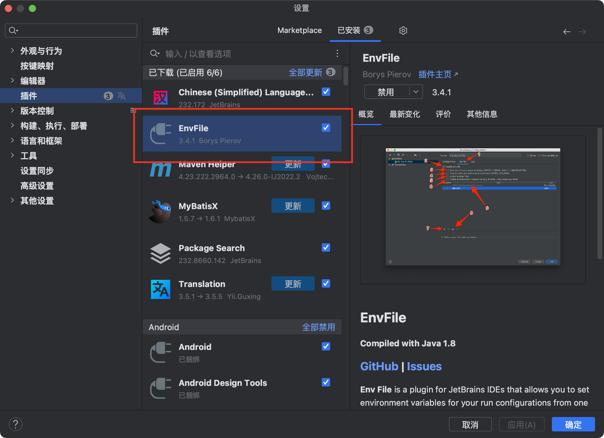
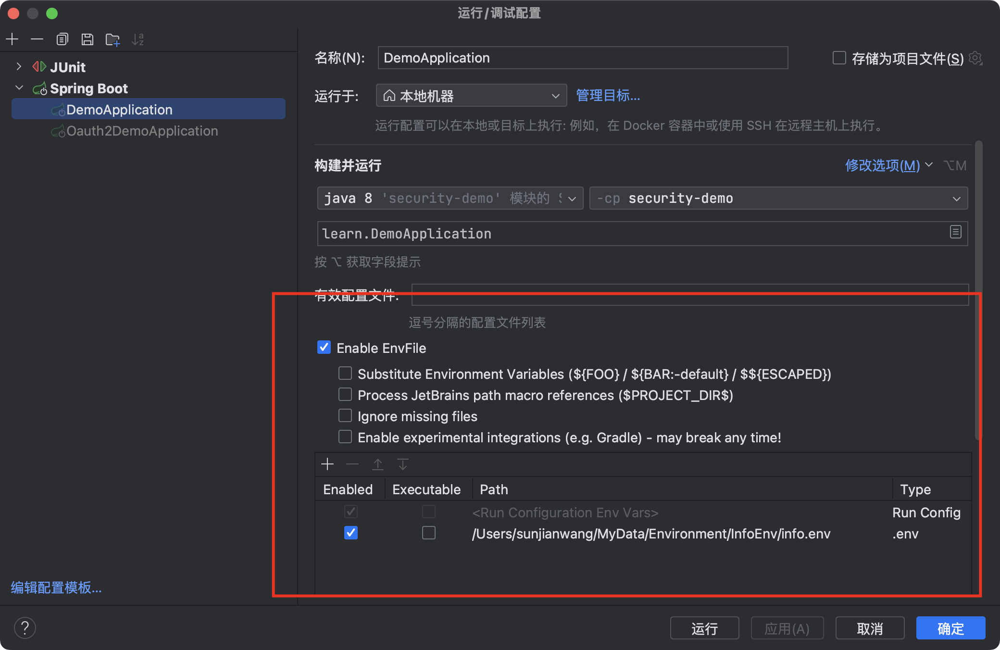

# 项目说明
​	此项目为个人学习SpringSecurity和Oauth2 Authorization Server时记录练习所产出，仅供参考。

# 项目结构

​	项目使用maven进行包管理，其中有两个子模块：**security-demo**和**oauth2-demo**。

**security-demo**

​	主要进行了Security认证授权的记录和简单演示，具体包括：表单登录配置，Http安全配置，自定义认证过滤器，自定义参数校验及密码验证，采用JWT的Token生成和校验，二次登录验证，方法级授权，阿里云短信发送等

**oauth2-demo**

​	由于在Authorization Server中，官方默认移除了使用账号密码登录的方式，所以该模块主要实现了自定义账号密码登录的方式。

> PS：其实严格意义上讲security-demo应该算是一个资源服务器，oauth2-demo是一个认证授权服务器，只不过我在学习过程中并没有详细做区分，见谅。

# 配置说明

​	由于一些配置，比如我自己的服务器IP，阿里云短信的ID和Secret不太好展示，所以我使用了本地配置的方式去运行，具体方法如下：

1. 打开Idea插件，搜索**EnvFile**

   

2. 安装好后在本地创建.env文件(提供模板)

3. 在.env文件中配置好自己的数据库地址等信息

4. 在运行配置中选中配置文件运行即可

   
